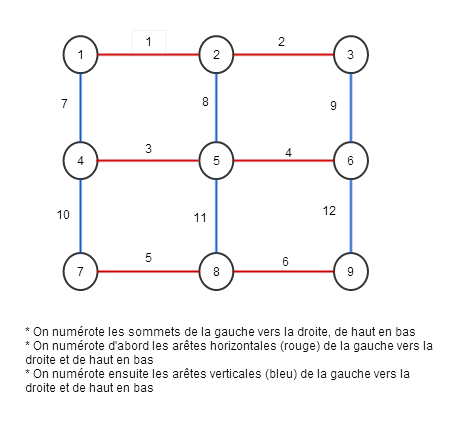

**Binôme : Malek MAMMAR & Alexandre LE JEAN**

Dans ce DM nous nous efforcerons cette fois-ci a fournir une description plus détailler de notre démarche suite a la remarque de Arnaud Legrand.

**Question 1**

Choix de modélisation : 
On souhaite tirer uniformément sur notre ensemble d'arêtes. Pour cela avons besoin d'un tableau contenant 1 ou 0 si respectivement le sommet d'indice i est infecté ou non.

Dans cette question on est en présence d'un graphe complet, modélisation ci-dessus à elle seule suffit car quelque soit le couple de sommets tirés il existe une forcément une arête les reliants.

```{r}
#Cette fonction renvoie un tableau de sommets dont 1 sommet est infecté
generateur_sommet_malade <- function (N = 10, initInfecté = 1) {
  if (initInfecté <= N) {
    graphe = array(0, N)
    for(i in 1:initInfecté) {
      repeat {
        sommet = floor(runif(n = 1 , min = 1, max = N+1))
        if (graphe[sommet] != 1) 
          break
    }
    graphe[sommet] = 1  
    }
    
    graphe  
  } else {
    print("Erreur : Le nombre de personnes infectées > la population")
  }
}

generateur_sommet_malade()

```

```{r}

#Cette fonction tire uniformement une arete de notre graphe complet
gene_arete_complet <- function (N = 10) {
  #on repete jusqu'à ne pas avoir un boucle
  repeat {
    arete = floor(runif(n = 2, min = 1, max = N+1))
    if (arete[1] != arete[2]) break
  }
  
  arete
}

gene_arete_complet()

```


```{r}
set.seed(42)

#Lancement de la simulation
simulation1 <- function( N = 10, generateur_arete, nb_personnes_Infectées = 1) {

  graphe = generateur_sommet_malade(N = N, initInfecté = nb_personnes_Infectées)
  nbSommetInfecté = nb_personnes_Infectées;
  T_N = 0;

  df = data.frame(Temps = c(T_N), nbInfecté = c(nbSommetInfecté))
  while ( nbSommetInfecté < N ) {
    arete = generateur_arete(N);
    x = arete[1];
    y = arete[2];

    if ((graphe[x] == 1) || (graphe[y] == 1)) {
      
      #Si x et y ne sont pas tous les deux infectés
      if (! ((graphe[x] == 1) && (graphe[y] == 1)) ) { 
        nbSommetInfecté = nbSommetInfecté + 1;
      }
      graphe[x] = 1;
      graphe[y] = 1;
    }
    
    T_N = T_N + 1;
    df = rbind(df, data.frame(Temps = T_N, nbInfecté = nbSommetInfecté))
  }
  
  df
}

```

Observons l'évolution de $T_N$ en fonction de N :
```{r}
library(ggplot2)
set.seed(42);

df2 = data.frame(N = c(), T_N = c())
for(samples in 1:10) {
  Ni = samples * 10
  df2 = rbind(df2, data.frame(N = Ni, T_N = tail(simulation1(Ni, gene_arete_complet), 1)$Temps ))
}

df2
#plot(df)
ggplot(data=df2, aes(x=N)) + geom_line(data=df2,aes(y=T_N),color="red") + theme_bw()
```

Conclusion :
Dans le cas d'un graphe complet on peut remarquer que le temps nécessaire pour que toute la population soit infectée évolue grossièrement de façon logarithmique par rapport a l'effectif de la population. Ce qui nous pensons expliquerait la decroissance entre 800 et 900.

Il serait interessant de tracer la courbe épidemique afin d'avoir une idée de comment est ce que le virus se propage sur une population de taille N

```{r}
library(ggplot2)
set.seed(42);

N = 1000
df = simulation1(N, gene_arete_complet)
ggplot(data=df, aes(x=Temps)) + geom_line(data=df,aes(y=nbInfecté),color="red") + theme_bw()
```

Conclusion:
On remarque la contamination évolue de manière exponentielle dès l'infection d'une personne au temps 0.
En l'espace de 4000 unités de temps la moitié de la population est déjà infectée et 2000 unités de temps plus tards toute la population est quasi infectée.
On ne que rester stupéfait devant la rapidité de l'infection dans un graphe connexe.

**Question 2**

Graphe ligne 1D et grille 2D

1. Lorsque le graphe est une ligne :

```{r}
#Cette fonction tire uniformement une arete de notre graphe en ligne
gene_arete_ligne <- function (N = 10) {
  x = floor(runif(n = 1, min = 1, max = N)) #On tire uniformement x sur [0..N-1]
  y = x+1
  c(x, y)
}
```

```{r}
#Cette fonction tire uniformement une arete de notre graphe en ligne avec tore
gene_arete_ligne_tore <- function (N = 10) {
  x = floor(runif(n = 1, min = 1, max = N+1)) #On tire uniformement x sur [0..N]
  if (x == N)
    y = 1
  else
    y = (x+1)
  
  c(x, y)
}
```


```{r}
evolution_T_N <- function (simulateur = simulation1, generateur, pas=10, nbSamples=10, nbInfecté = 1, coeff_pers_infecté = 0) {
  library(ggplot2)
  set.seed(42);
  
  #Fonction permettant de modifier la proportions de la population infectée
  proportion = function () {
    if (coeff_pers_infecté != 0) {
      floor(Ni * coeff_pers_infecté)
    } else {
      nbInfecté
    }
  }
  
  df2 = data.frame(N = c(), T_N = c())
  for(samples in 1:nbSamples) {
    Ni = samples * pas
    df2 = rbind(df2, data.frame(N = Ni, T_N = tail(simulateur(Ni, generateur, proportion()), 1)$Temps ))
  }
  
  df2
  ggplot(data=df2, aes(x=N)) + geom_line(data=df2,aes(y=T_N),color="red") + theme_bw()
}
```


```{r}
courbe_epidemique <- function (simulteur=simulation1, generateur, N=100, nbInfecté = 1) { 
  library(ggplot2)
  set.seed(42);
  
  df = simulateur(N, generateur, , nbInfecté)
  ggplot(data=df, aes(x=Temps)) + geom_line(data=df,aes(y=nbInfecté),color="red") + theme_bw()
}
```

Réitérons notre simulation et observons l'évolution de $T_N$ en fonction de N sur un graphe 1D

  - SANS tore :

```{r}
evolution_T_N(simulateur = simulation1, generateur = gene_arete_ligne, pas = 20, nbSamples = 10)

```
==========
Avec un generateur pour un graphe coomplet la simualtion termine en un temps raisonnable tantdis que avec un generateur d'arete de graphe 1D, la simultion ne termine pas. 
Au vu de la courbe (pas = 10, nbSamples = 10) à allure exponentielle, le résultat est confirmer
============
Conclusion : 
Plus la population est grande plus le temps $T_N$ est grand (il est par contre étrange que ce temps diminue a partir d'un certain seuil : Pour pas=10, nbsamples=10). Contrairement à la question 1 où l'évolution de $T_N$ paraissait logarithmique, ici la courbe a une allure exponentielle : cela reste cohérent avec le fait du nombre de connexion limité a $N-1$ contre $\sum_{i=1}^{N} N-i = \sum_{i=0}^{N-1} i = ((N-1) * N)/2 = o(N^2)$
Pour le confirmer et se fixer sur les mêmes ordres de grandeurs qu'à la question 1, nous avons tenter d'augmenter le pas vers 100, et de laisser nombre de simulation à 10. Autant à la question 1 la simulation se terminait en un temps raisonnable, à celle-ci il elle ne se termine pas.
Ce qui confirme notre hyspothèse sur l'allure exponentielle de la courbe.


La courbe épidemique :
```{r}
courbe_epidemique(simulteur = simulation1, generateur = gene_arete_ligne, N = 200)
```

Conlusion : La courbe épidémique est bien moins fulgurante que dans le cas du graphe complet. Ca se voit bien, et s'explique bien par le fait que tous les sommets sont de degrés au plus 2. On est tenté de dire qu'il s'agit d'une courbe logarithmique vu l'allure de la courbe a partir de zero. Il faudrait essayer avec un N > 100 afin d'en être plus sûr


  - AVEC tore :
  
  Le tore n'influe pas grandement sur les résultats précédents car il ne s'agit que de l'ajout d'une arête 
  
```{r}
evolution_T_N(simulateur = simulation1, generateur = gene_arete_ligne_tore, pas = 10, nbSamples = 10)

```

La courbe épidemique :
```{r}
courbe_epidemique(simulteur = simulation1, generateur = gene_arete_ligne_tore, N = 100)
```

*Faisant varier le nombre de personnes infectées*

```{r}
library(gridExtra)
library(ggplot2)

g1 = evolution_T_N(simulateur = simulation1, generateur = gene_arete_ligne, pas = 10, nbSamples = 10, nbInfecté = 1 ) + ggtitle("1 personne infectée")

g2 = evolution_T_N(simulateur = simulation1, generateur = gene_arete_ligne, pas = 10, nbSamples = 50, coeff_pers_infecté = 1/4 ) + ggtitle("1/4 de la popluation infectée")

g3 = evolution_T_N(simulateur = simulation1, generateur = gene_arete_ligne, pas = 10, nbSamples = 50, coeff_pers_infecté = 1/2 ) + ggtitle("1/2 de la population infectée")

g4 = evolution_T_N(simulateur = simulation1, generateur = gene_arete_ligne, pas = 10, nbSamples = 50, coeff_pers_infecté = 3/4 ) + ggtitle("3/4 de la population infectée")

grid.arrange(g1, g2, g3, g4, ncol=2, nrow=2)
```

La principale remarque qui se degage de porte sur le temps de l'infection totale de la population qui decroit quand proportion de personne infectée augmente.


2. Lorsque le graphe est une grille 2D : 
 
 Pour notre choix de modélisation :
 On peut distinguer deux types d'arêtes : les arêtes verticales, et les arêtes horizontales (Voir l'exemple ci-contre) 
 
 
 
 Soient : 
    M : la hauteur de la grille
    N : la largeur de la grille
    N*M : le nombre de sommets de la grille
    nbArete : le nombre d'arêtes $2NM-N-M$
 
 - Dans le cas SANS tore : 
  
  Le tirage uniforme dans une grille 2D se fait comme suit :
  
```{r}
#Dans l'experience la grille est carrée donc N = M
gene_arete_grille <- function (N, M = N) {
  nbArete = 2*N*M - N - M
  nbSommet = N * M
  x = floor(runif(n = 1, min = 1, max = nbArete + 1))
  print(x)
  if ( x <= ((N-1)*M)) {
    #On est dans les arêtes horizontales
    x = x + floor((x-1)/(N-1))
    y = x + 1
  } else {
    #On est dans les arêtes verticales
    x = x - ((N-1) * M)
    y = x + N
  }
  
  c(x,y)
}

```

Simulation : 
===============
```{r}
gene_arete_grille(3)
```

```{r}
gene_arete_grille(3)
df = data.frame(noArete =c(0,0), couple = c(0,0))
for(i in 1:10) {
  res = gene_arete_grille(3)
  df = rbind(df, data.frame(noArete = c(res[3], 999), couple = c(res[1], res[2])))
}
df
```
==============
```{r}
evolution_T_N(simulateur = simulation1, generateur = gene_arete_grille, pas = 10, nbSamples = 10)
```


  - Dans le cas AVEC tore : 
  
  Le tirage uniforme se fait comme suit :
  
```{r}
gene_arete_grille_tore <- function (N, M) {
  nbArete = 2*N*M - N - M
  nbSommet = N * M
  x = floor(runif(n = 1, min = 1, max = nbArete + 1))
  
  if ( x <= (N*M)) {
    #On est dans les arêtes horizontales
    if ((x%N) == 0) {
      #On est sur la colonne la plus a droite de la grille
      y = ceiling(x/N)
    } else {
      y = x + 1  
    }
    
  } else {
    #On est dans les arêtes verticales
    x = x - N*M
    if (x > (2*M*N - N)) {
      #On est sur la ligne la plus en bas de la grille
      y = x %% N
    } else {
        y = x + N      
    }
  }
  
  c(x,y)
}

```


**Question 3**
