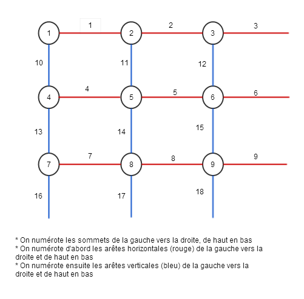

**Binôme : Malek MAMMAR & Alexandre LE JEAN**

Nous soussinés MAMMAR et LE JEAN déclarons sur l'honneur que ce rapport est le fruit d'un travail personnel, en binôme, que nous n'avons contrefait, ni falsifié, ni copié tout ou partie de l'oeuvre d'autrui afin de le faire passer pour notre.
Toutes les sources d'information utilisées et les citations d'auteur ont été mentionnées conformément au usages en vigueur.
Nous sommes conscients que le fait de ne pas citer une source ou de ne pas la citer clairement et complètement est constitutif de plagiat, que le plagiat est considéré comme une faute grave au sein de l'université, pouvant sévèrement sanctionnée par la loi.


Dans ce DM nous nous efforcerons cette fois-ci a fournir une description plus détaillée de notre démarche suite à la remarque de Arnaud Legrand.

**Question 1**

Choix de modélisation : 
On souhaite tirer uniformément sur notre ensemble d'arêtes. Pour cela nous avons besoin d'un tableau contenant 1 ou 0 si respectivement le sommet d'indice i est infecté ou non.

Dans cette question on est en présence d'un graphe complet, la modélisation ci-dessus à elle seule suffit car quelque soit le couple de sommets tiré il existe une forcément une arête les reliants.

```{r}
#Cette fonction renvoie un tableau de sommets dont 1 sommet est infecté
generateur_sommet_malade <- function (N = 10, initInfecté = 1) {
  if (initInfecté <= N) {
    graphe = array(0, N)
    for(i in 1:initInfecté) {
      repeat {
        sommet = floor(runif(n = 1 , min = 1, max = N+1))
        if (graphe[sommet] != 1) 
          break
    }
    graphe[sommet] = 1  
    }
    
    graphe  
  } else {
    print("Erreur : Le nombre de personnes infectées > la population")
  }
}

```

```{r}

#Cette fonction tire uniformement une arete de notre graphe complet
gene_arete_complet <- function (N = 10) {
  #on repete jusqu'à ne pas avoir un boucle
  repeat {
    arete = floor(runif(n = 2, min = 1, max = N+1))
    if (arete[1] != arete[2]) break
  }
  
  arete
}

```


```{r}
set.seed(42)

#Lancement de la simulation
simulation1 <- function( N = 10, generateur_arete, nb_personnes_Infectées = 1) {

  graphe = generateur_sommet_malade(N = N, initInfecté = nb_personnes_Infectées)
  nbSommetInfecté = nb_personnes_Infectées;
  T_N = 0;

  df = data.frame(Temps = c(T_N), nbInfecté = c(nbSommetInfecté))
  while ( nbSommetInfecté < N ) {
    arete = generateur_arete(N);
    x = arete[1];
    y = arete[2];

    if ((graphe[x] == 1) || (graphe[y] == 1)) {
      
      #Si x et y ne sont pas tous les deux infectés
      if (! ((graphe[x] == 1) && (graphe[y] == 1)) ) { 
        nbSommetInfecté = nbSommetInfecté + 1;
      }
      graphe[x] = 1;
      graphe[y] = 1;
    }
    
    T_N = T_N + 1;
    df = rbind(df, data.frame(Temps = T_N, nbInfecté = nbSommetInfecté))
  }
  
  df
}

```

Observons l'évolution de $T_N$ en fonction de N :
```{r}
library(ggplot2)
set.seed(42);

df2 = data.frame(N = c(), T_N = c())
for(samples in 1:10) {
  Ni = samples * 10
  df2 = rbind(df2, data.frame(N = Ni, T_N = tail(simulation1(Ni, gene_arete_complet), 1)$Temps ))
}

ggplot(data=df2, aes(x=N)) + geom_line(data=df2,aes(y=T_N),color="red") + theme_bw() + ggtitle( label = "L'évolutions de T_N en fonction de N - Graphe complet")
```

Conclusion :
Dans le cas d'un graphe complet on peut remarquer que le temps nécessaire pour que toute la population soit infectée évolue grossièrement de façon logarithmique par rapport a l'effectif de la population. Ce qui nous pensons expliquerait la decroissance entre 800 et 900.

Il serait intéressant de tracer la courbe épidemique afin d'avoir une idée de comment est ce que le virus se propage sur une population de taille N

```{r}
library(ggplot2)
set.seed(42);

N = 1000
df = simulation1(N, gene_arete_complet)
ggplot(data=df, aes(x=Temps)) + geom_line(data=df,aes(y=nbInfecté),color="red") + theme_bw() + ggtitle( label = "Courbe épidémique T en fonction de N - Graphe complet")
```

Conclusion:
On remarque que la contamination évolue de manière exponentielle dès l'infection d'une personne au temps 0.
En l'espace de 4000 unités de temps la moitié de la population est déjà infectée et 2000 unités de temps plus tards toute la population est quasi infectée.
On ne que rester stupéfait devant la rapidité de l'infection dans un graphe connexe.

**Question 2**

Graphe ligne 1D et grille 2D

1. Lorsque le graphe est une ligne :

Tout d'abord nous définissons les fonction qui nous seront nécessaires : 

Cette fonction tire uniformément une arête de notre graphe en ligne
```{r}
#Cette fonction tire uniformement une arete de notre graphe en ligne
gene_arete_ligne <- function (N = 10) {
  x = floor(runif(n = 1, min = 1, max = N)) #On tire uniformement x sur [0..N-1]
  y = x+1
  c(x, y)
}
```

Cette fonction tire uniformément une arete de notre graphe en ligne avec tore
```{r}
#Cette fonction tire uniformement une arete de notre graphe en ligne avec tore
gene_arete_ligne_tore <- function (N = 10) {
  x = floor(runif(n = 1, min = 1, max = N+1)) #On tire uniformement x sur [0..N]
  if (x == N)
    y = 1
  else
    y = (x+1)
  
  c(x, y)
}
```

Nous définissons aussi des fonction auxiliares, afin d'éviter la répétition de code ultéterieurement

Cette fonction trace l'évolution de $T_N$
```{r}
evolution_T_N <- function (simulateur = simulation1, generateur, pas=10, nbSamples=10, nbInfecté = 1, coeff_pers_infecté = 0) {
  library(ggplot2)
  set.seed(42);
  
  #Fonction permettant de modifier la proportions de la population infectée
  proportion = function () {
    if (coeff_pers_infecté != 0) {
      floor(Ni * coeff_pers_infecté)
    } else {
      nbInfecté
    }
  }
  
  df2 = data.frame(N = c(), T_N = c())
  for(samples in 1:nbSamples) {
    Ni = samples * pas
    df2 = rbind(df2, data.frame(N = Ni, T_N = tail(simulateur(Ni, generateur, proportion()), 1)$Temps ))
  }
  
  df2
  ggplot(data=df2, aes(x=N)) + geom_line(data=df2,aes(y=T_N),color="red") + theme_bw() 
}
```

Cette fonction trace la courbe épidémique
```{r}
courbe_epidemique <- function (simulateur=simulation1, generateur, N=100, nbInfecté = 1) { 
  library(ggplot2)
  set.seed(42);
  
  df = simulateur(N, generateur, nbInfecté)
  ggplot(data=df, aes(x=Temps)) + geom_line(data=df,aes(y=nbInfecté),color="red") + theme_bw()
}
```

Ainsi comme à la question 1, réitérons notre simulation et observons l'évolution de $T_N$ en fonction de N sur un graphe 1D (en ligne)

  - Grahe 1D, SANS tore :

```{r}
#evolution_T_N(simulateur = simulation1, generateur = gene_arete_ligne, pas = 20, nbSamples = 10) + ggtitle( label = "L'évolutions de $T_N$ en fonction de N - Generateur d'arête dans une ligne SANS tore")

```


Conclusion : 
Plus la population est grande plus le temps $T_N$ est grand (il est par contre étrange que ce temps diminue à partir d'un certain seuil : Pour pas=10, nbsamples=10). Contrairement à la question 1 où l'évolution de $T_N$ paraissait logarithmique, ici la courbe a une allure exponentielle : cela reste cohérent avec le fait du nombre de connexion limité a $N-1$ contre $\sum_{i=1}^{N} N-i = \sum_{i=0}^{N-1} i = ((N-1) * N)/2 = o(N^2)$
Pour le confirmer et se fixer sur les mêmes ordres de grandeurs qu'à la question 1, nous avons tenté d'augmenter le pas vers 100, et de laisser le nombre de simulations (nbSamples) à 10. Autant à la question 1 la simulation se terminait en un temps raisonnable, à celle-ci il elle ne se termine pas.
Ce qui nous supposons confirme notre hypothèse sur l'allure exponentielle de la courbe avec les valeurs Pour pas=10, nbsamples=10.


La courbe épidemique :
```{r}
#courbe_epidemique(simulateur = simulation1, generateur = gene_arete_ligne, N = 200) + ggtitle( label = "La courbe épidémique en fonction de N - Generateur d'arête dans une ligne SANS tore")
```

Conlusion : 

La courbe épidémique est bien moins fulgurante que dans le cas du graphe complet. Cela se voit bien sur le graphe ci-dessous, et s'explique bien par le fait que tous les sommets sont de degrés au plus 2. On est tenté de dire qu'il s'agit d'une courbe logarithmique vu l'allure de la courbe a partir de zero. Il faudrait essayer avec un N > 100 afin d'en être plus sûr.
Ca se confirme pour un pas N = 200


  - Grahe 1D, AVEC tore :
    
```{r}
#evolution_T_N(simulateur = simulation1, generateur = gene_arete_ligne_tore, pas = 10, nbSamples = 10) + ggtitle( label = "L'évolutions de $T_N$ en fonction de N - Generateur d'arête dans une ligne avec tore")

```

La courbe épidemique :
```{r}
#courbe_epidemique(simulateur = simulation1, generateur = gene_arete_ligne_tore, N = 100) + ggtitle( label = "La courbe épidémique en fonction de N - Generateur d'arête dans une ligne avec tore")
```

  On remarquera que le tore n'influe pas grandement sur les résultats précédents car il ne s'agit que de l'ajout d'une arête. 


Maintenant observons ce qui passe lorsque nous faisons varier le nombre de personnes infectées dans le cas sans tore

```{r}
library(gridExtra)
library(ggplot2)

#g1 = evolution_T_N(simulateur = simulation1, generateur = gene_arete_ligne, pas = 10, nbSamples = 10, nbInfecté = 1 ) + ggtitle("1 personne infectée")

#g2 = evolution_T_N(simulateur = simulation1, generateur = gene_arete_ligne, pas = 10, nbSamples = 50, coeff_pers_infecté = 1/4 ) + ggtitle("1/4 de la popluation infectée")

#g3 = evolution_T_N(simulateur = simulation1, generateur = gene_arete_ligne, pas = 10, nbSamples = 50, coeff_pers_infecté = 1/2 ) + ggtitle("1/2 de la population infectée")

#g4 = evolution_T_N(simulateur = simulation1, generateur = gene_arete_ligne, pas = 10, nbSamples = 50, coeff_pers_infecté = 3/4 ) + ggtitle("3/4 de la population infectée")

#grid.arrange(g1, g2, g3, g4, ncol=2, nrow=2) + ggtitle( label = "Les différentes évolutions de $T_N$ en fonction de N selon l'effectif de la population infectée au temps 0 - Generateur d'arête dans une grille avec tore")
```

Comme attendu, le temps de l'infection totale de la population decroit quand la proportion de personne infectée augmente.


2. Lorsque le graphe est une grille 2D : 
 
 Pour notre choix de modélisation nous avons joint deux schémas reflétants notre vision d'un graphe dans le cas avec ET sans tore :

 On choisit de distinguer deux types d'arêtes : les arêtes verticales (en bleu), et les arêtes horizontales (en rouge) (Voir l'image ci-dessous). Le but de ces représentations étant de retrouver les sommets associés à l'arête tirée aléatoirement.
 
 - Dans le cas SANS tore : 
 
 
 
 Soient les variables suivantes, dans l'algorithme de générateur de graphe en grille : 
 
    - M : la hauteur de la grille
    - N : la largeur de la grille
    - N*M : le nombre de sommets de la grille
    - nbArete : le nombre d'arêtes $2NM-N-M$
 
  
  Le tirage uniforme dans une grille 2D se fait comme suit :
  
```{r}
#Dans l'experience la grille est carrée donc N = M
gene_arete_grille <- function (N, M = N) {
  nbArete = 2*N*M - N - M
  nbSommet = N * M
  x = floor(runif(n = 1, min = 1, max = nbArete + 1))
  if ( x <= ((N-1)*M)) {
    #On est dans les arêtes horizontales
    x = x + floor((x-1)/(N-1))
    y = x + 1
  } else {
    #On est dans les arêtes verticales
    x = x - ((N-1) * M)
    y = x + N
  }
  
  c(x,y)
}

```

Implémentation de la fonction de simulation : 

```{r}
set.seed(42)

#Lancement de la simulation dans le cas d'une grille
simulation2 <- function( N = 10, generateur_arete, nb_personnes_Infectées = 1, M = N) {

  graphe = generateur_sommet_malade(N = N * M, initInfecté = nb_personnes_Infectées)
  nbSommetInfecté = nb_personnes_Infectées;
  T_N = 0;

  df = data.frame(Temps = c(T_N), nbInfecté = c(nbSommetInfecté))
  while ( nbSommetInfecté < N ) {
    arete = generateur_arete(N, M);
    x = arete[1];
    y = arete[2];

    if ((graphe[x] == 1) || (graphe[y] == 1)) {
      
      #Si x et y ne sont pas tous les deux infectés
      if (! ((graphe[x] == 1) && (graphe[y] == 1)) ) { 
        nbSommetInfecté = nbSommetInfecté + 1;
      }
      graphe[x] = 1;
      graphe[y] = 1;
    }
    
    T_N = T_N + 1;
    df = rbind(df, data.frame(Temps = T_N, nbInfecté = nbSommetInfecté))
  }
  
  df
}

```

```{r}
#evolution_T_N(simulateur = simulation2, generateur = gene_arete_grille, pas = 10, nbSamples = 7) + ggtitle(label = "Evolution de $T_N$ en fonction de N - Generateur d'arête dans une grille SANS tore")
```

Conclusions :

L'évolution de $T_N$ en fonction de N est là aussi exponentielle tout comme dans le graphe 1D. Le manque d'arêtes entre les sommets influe grandement sur la propagation du virus.


  - Dans le cas AVEC tore : 
  
   Sur une grille 3*3, voici schématiquement notre choix de modélisation : 
   
   
   
   Nous sommes conscient de l'éxistence d'une seconde façon de procéder (décrite ci-dessous)  :
   
   Chaque sommet est en contact avec 4 arêtes, il suffit donc de prendre uniformément un nombre dans [1..N] où N est le nombre de sommets, puis prendre un nombre dans [1..4]: les nombres de 1 à 4 représentants respectivement : le sommet en haut, à droite, en bas et à gauche.
C'est moins lourd à mettre en place et c'est surtout plus simple à comprendre, le tirage qu'on propose permet juste de faire un seul tirage parmi toutes les arêtes disponibles. 
Le but de la modélisation étant d'associer chaque numéro d'arête à un couple de sommet (x,y) que l'on peut calculer à partir du numéro de l'arête.
   
   
  Le tirage uniforme se fait comme suit :
  
```{r}
gene_arete_grille_tore <- function (N = 3, M = N) {
  nbArete = 2*N*M
  a = floor(runif(n = 1, min = 1, max = nbArete + 1))
  
  if ( a <= (N*M)) {
    #On est dans les arêtes horizontales
    if ((a %% N) == 0) {
      #On est dans une arete du tore
      x = a
      y = x + 1 - N
      
    } else {
      x = a
      y = x + 1
    }
    
  } else {
    #On est dans les arêtes verticales
    #On aura remarqué que toutes arêtes verticale ont leur sommet "du coté haut" égale à a - N*M
    if ( a <= (2*M*N - N) ) {
      #On n'est pas dans une arete du tore
      x = a - N*M
      y = x + N
    } else {
        x = a - N*M
        y = x %% N
        if ( y == 0 ) {
          y = N
        }
    }
  }
  
  c(x,y, a)
}

```


```{r}
#evolution_T_N(simulateur = simulation2, generateur = gene_arete_grille_tore, pas = 10, nbSamples = 7) + ggtitle( label = "Evolution de $T_N$ en fonction de N² - Generateur d'arête dans une grille avec tore")
```

Conclusions : 

Nous remarquons que la pente de la courbe dans une grille avec tore est moins ardue que celle sans tore, ce qui concorde tout à fait avec ce à quoi on s'attendait du fait d'un plus de connexions


Maintenant faisant varier le nombre de personnes infectées dans une grille avec tore

```{r}
library(gridExtra)
library(ggplot2)

#g1 = evolution_T_N(simulateur = simulation2, generateur = gene_arete_grille_tore, pas = 10, nbSamples = 7, nbInfecté = 1 ) + ggtitle("1 personne infectée")

#g2 = evolution_T_N(simulateur = simulation2, generateur = gene_arete_grille_tore, pas = 10, nbSamples = 7, coeff_pers_infecté = 1/4 ) + ggtitle("1/4 de la popluation infectée")

#g3 = evolution_T_N(simulateur = simulation2, generateur = gene_arete_grille_tore, pas = 10, nbSamples = 7, coeff_pers_infecté = 1/2 ) + ggtitle("1/2 de la population infectée")

#g4 = evolution_T_N(simulateur = simulation2, generateur = gene_arete_grille_tore, pas = 10, nbSamples = 7, coeff_pers_infecté = 3/4 ) + ggtitle("3/4 de la population infectée")

#grid.arrange(g1, g2, g3, g4, ncol=2, nrow=2) + ggtitle( label = "Les différentes évolutions de $T_N$ en fonction de N² selon l'effectif de la population infectée au temps 0 - Generateur d'arête dans une grille avec tore")
```

NB : La taille de la grille (le nombre de sommet) est en $N^2$, contrairement à ce qui est indiqué sur la légende.

Nous remarquons que les temps $T_N$ diminuent quand la population initialement infectée est plus grande, rien d'étonnant. Cela dit, des comportements étranges s'observent sur les figures $1/4$ et $3/4$ de la population infectée : une décroissance de la courbe qui nous pensons pourrait s'expliquer par le manque d'échantillants sur la partie non infectée de la population (Nous n'en sommes pas certains)


**Question 3**

Elaboration du générateur de graphe de Erdos-Renyi :

```{r}
# N : nombre de sommet
# p : parametre de la loi de B
# graphe est la matrice d'ajdacence du graphe connexe générer
generateur_erdos_renyi <- function(N = 10, p = 0.5)
{
  graphe = matrix(0, nrow = N, ncol = N)
  repeat
  {
      for(i in 1:N)
      {
        for ( j in i+1:N)
        {
          if (j <= N) { #Sinon j va jusqu a N+1
            x = runif(n=1)
            if(x<p)
            {
              graphe[i,j] = 1
              graphe[j,i] = 1
            }
          }
        }
      }
      # on vérifie que le graphe est connexe
      sommet = array(0,N) #1 si les sommets sont decouvert par le pacour, 0 sinon
      tab = array(0,N) #liste des sommets a parcourir
      tab[1] = 1
      sommet[1] = 1
      n = 1 #nombre de sommet traiter
      x = 1 #indice de tab a traiter
      cpt = 2 #indice de la prochaine case de tab libre
  
      while( n < N && x <= N && tab[x] != 0 )
      {
          for(j in tab[x] +1 : N)
          {
                if(j <= N)
                {
                  if(graphe[tab[x],j] == 1 && sommet[j] != 1)
                  {
                      tab[cpt] = j
                      cpt = cpt + 1
                      sommet[j] = 1
                      n = n+1
                  }
                }
          }
          x = x + 1
      }
      if(n==N) # on a parcourue tout les sommets avec le parcours en lageur, donc le graphe est connexe
          {break}
    }

    graphe
}
```

Remarques : 

Comme il est mentionné dans le sujet, les graphes générés ne sont pas forcément connexes. En effet une contruction de graphe de Erdos-Renyi implique d'affecter une variable aléatoire à chaque arête et si cette variable aléatoire est inférieure à une probabilité $P$ décidé abitrairement alors l'arête est retenue dans notre graphe.
Dans notre générateur de graphe de Erdos-Renyi nous prenons soins de vérifier que le graphe généré est connexe (par un simple parcours en largeur) sans quoi il rejeté et nous en recalculons un nouveau.

==============
TO DELEETE
```{r}
generateur_erdos_renyi(N = 10, p = 0.00001)
```
===============

Implémentation du simulateur 3 de graphe de Erdos-Renyi : 

```{r}
simulation_3 <- function(N = 10, p = 0.5, nbInfecté = 1, portionInfectée = 0)
{

  #fonction auxiliaire permettant de modifier le nombre de personnes infectés initialement
  infection <- function () {
    if (portionInfectée <= 1 && portionInfectée != 0) {
      floor(N * portionInfectée)
    } else if (nbInfecté <= N) {
      nbInfecté
    } else {
      N
    }
  }
  
  graphe = generateur_erdos_renyi(N,p)

  
  nb_arrete=0
	for(i in 1:N)
		{
      for(j in i+1 : N)
			{
        if (j <= N) {
          if(graphe[i,j] == 1)
  				{nb_arrete = nb_arrete +1}
        }
			}
		}
	arretesG = array(0,nb_arrete)
	arretesD = array(0,nb_arrete)
	x=1
	for(i in 1:N)
		{for(j in i+1 : N)
			{
        if (j <= N) {
          if(graphe[i,j] == 1)
    				{
              arretesG[x] = i
      				arretesD[x] = j
      				x=x+1
            }
        }
			}
		}
	
	
	sommets = array(0,N)
  for(i in 1:infection()){
    repeat {
      personne_infecté = floor(runif(n = 1 , min = 1, max = N+1))
      if (sommets[personne_infecté] != 1) {
        break
      }
    }
    sommets[personne_infecté] = 1
  }
	
  #simulation normale avec
  nb_infecter = 1
	T = 0
  df = data.frame(Temps = c(T), nb_infecté = c(infection()))
	while (nb_infecter < N)
	{
		#tirage dans 1 .. nb_arrete
		x = floor(runif(n=1, min = 1, max = nb_arrete+1))
		if(sommets[arretesG[x]] == 1 && sommets[arretesD[x]] == 0)
			{ 
        sommets[arretesD[x]] = 1
			  nb_infecter= nb_infecter +1
      }
		else if (sommets[arretesD[x]] == 1 && sommets[arretesG[x]] == 0)
			{
      sommets[arretesG[x]] = 1
			nb_infecter= nb_infecter +1
      }
		T = T+1
    df = rbind(df, data.frame(Temps = T, nb_infecté = nb_infecter))
	}
	(list (df = df, nbArete = nb_arrete))
}

```


Voici l'évolution de $T_N$ en fonction de la probabilité $P$

```{r}

simulation3_evolution_p <- function (N = 10, seuilProbaMin = 0.5, pas=0.1, nbInfecté = 1, coeff_pers_infecté = 0) {
  library(ggplot2)
  set.seed(42);
  p = seuilProbaMin
  add = (1-seuilProbaMin) * pas
  df2 = data.frame(Probabilité = c(), Temps_N = c())
  for(samples in 1:(1/pas)) {
    p = p + add
    df2 = rbind(df2, data.frame(Probabilité = p, Temps_N = tail((simulation_3(N = N, p = p, nbInfecté = nbInfecté, portionInfectée = coeff_pers_infecté)$df), 1)$Temps ))
  }
  
  df2
  ggplot(data=df2, aes(x=Probabilité)) + geom_line(data=df2,aes(y=Temps_N),color="blue") + theme_bw() 
}

#simulation3_evolution_p(N = 100, seuilProbaMin = 0.1, pas = 0.01)
```

Conclusions : 

Sur cette courbe on observe l'évolution des temps $T_N$ en fonction des probabilités. Par construction, du graphe de renyi seules les arêtes de probabilité  inférieur à la probabilité (en abscisse) sont conservés. La première intuition est de penser que le nombre d'arêtes augmente à mesure que Pi augmente. Et donc que le temps $T_N$ diminue (à mesure que le nombre de connexions augmente).
Malheureusement la courbe exprime tout autre chose.

Explorons un peu plus la relation existant entre le nombre d'arêtes du graphe en fonction de la probabilité p.

```{r}
simulation3_evolution_nbArete_et_p <- function (N = 10, seuilProbaMin = 0.5, pas=0.1, nbInfecté = 1, coeff_pers_infecté = 0) {
  library(ggplot2)
  set.seed(42);
  p = seuilProbaMin
  add = (1-seuilProbaMin) * pas
  df2 = data.frame(Probabilité = c(), Nombre_Arete = c())
  for(samples in 1:(1/pas)) {
    p = p + add
    df2 = rbind(df2, data.frame(Probabilité = p, Nombre_Arete = simulation_3(N = N, p = p, nbInfecté = nbInfecté, portionInfectée = coeff_pers_infecté)$nbArete ))
  }
  
  ggplot(data=df2, aes(x=Probabilité)) + geom_line(data=df2,aes(y=Nombre_Arete),color="red") + theme_bw()
}

#simulation3_evolution_nbArete_et_p (N = 10, seuilProbaMin = 0.1, pas = 0.01)
```

Il est très étrange que le nombre d'arête pour les probabilités très faibles soient aussi haut. Si je prend le nombre d'arete en Pi = 0.15 (le pic depassant la barre des 40 aretes) Cela veut dire que sur 40 tirage aleatoire j'ai eut des nombres inferieur a 0,15. 
Peut être vient du fait que a force de rejeter tous les graphes non connexeq, on finit par avoir des sequence aussi improbables ?


Essayons d'intuiter comment $T_N$ dépend de $N$ pour ddes valeurs de $p$ qui vous paraissenent intéressantes

```{r}
simulation3_evolution_T_N <- function (probabilité = 0.5, pas=10, nbSamples=10, nbInfecté = 1, coeff_pers_infecté = 0) {
  library(ggplot2)
  set.seed(42);
  
  df2 = data.frame(N = c(), T_N = c())
  for(samples in 1:nbSamples) {
    Ni = samples * pas
    df2 = rbind(df2, data.frame(N = Ni, T_N = tail(simulation_3(N = Ni, p = probabilité, nbInfecté = nbInfecté, portionInfectée = coeff_pers_infecté)$df, 1)$Temps ))
  }
  
  df2
  ggplot(data=df2, aes(x=N)) + geom_line(data=df2,aes(y=T_N),color="blue") + theme_bw() 
}
```
